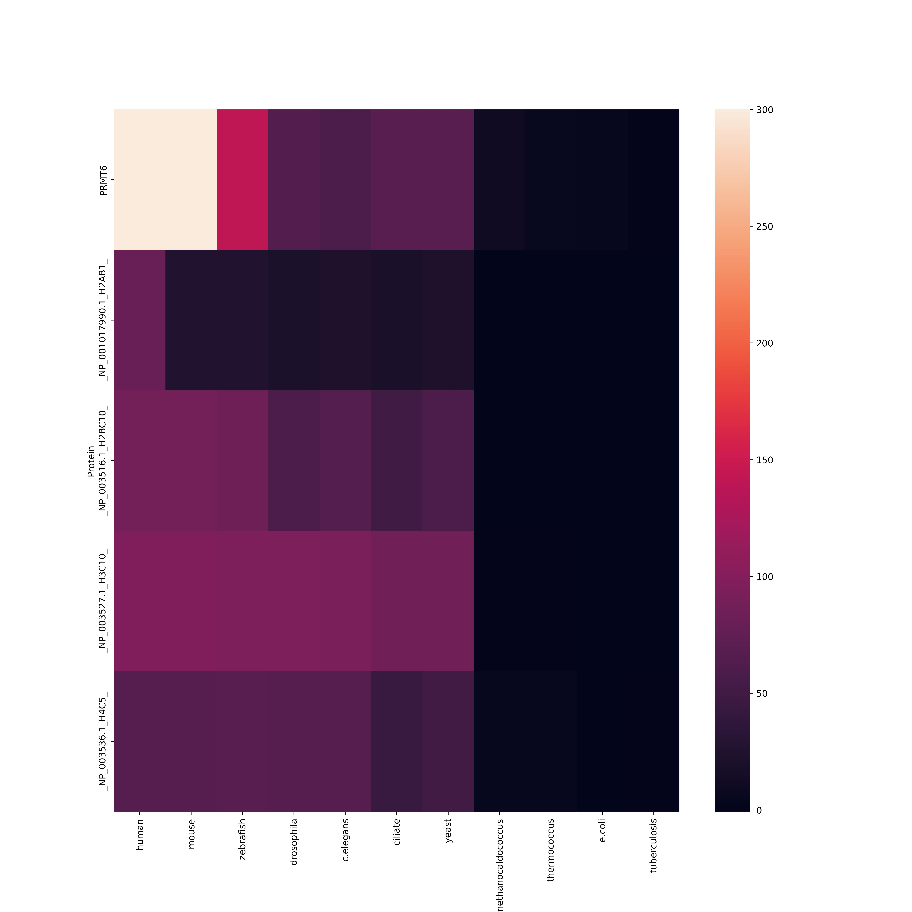
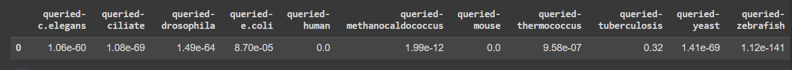
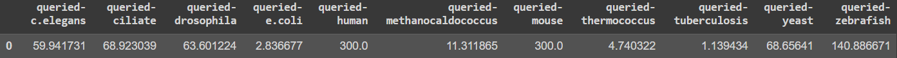

# hse23_project
 
Выбранный белок - PRMT6.  
Функция:Histone modification write.  
Экспресиия: EBV-transformed lymphocytes: 27.26,  Cultured fibroblasts: 25.97, Adrenal Gland:16.7, Bladder 13.64  
Доказательства связи с меткой H4: 
1) https://pubmed.ncbi.nlm.nih.gov/26094878/ Цитата: Using mass spectrometry under native conditions, we show that PRMT6 dimer binds two cofactor and a single H4 peptide molecules.  
2) https://pubmed.ncbi.nlm.nih.gov/34492270/ Цитата: We found that PRMT1, PRMT3, PRMT5, PRMT6, PRMT7, and PRMT8 preferentially methylate histone H4  

